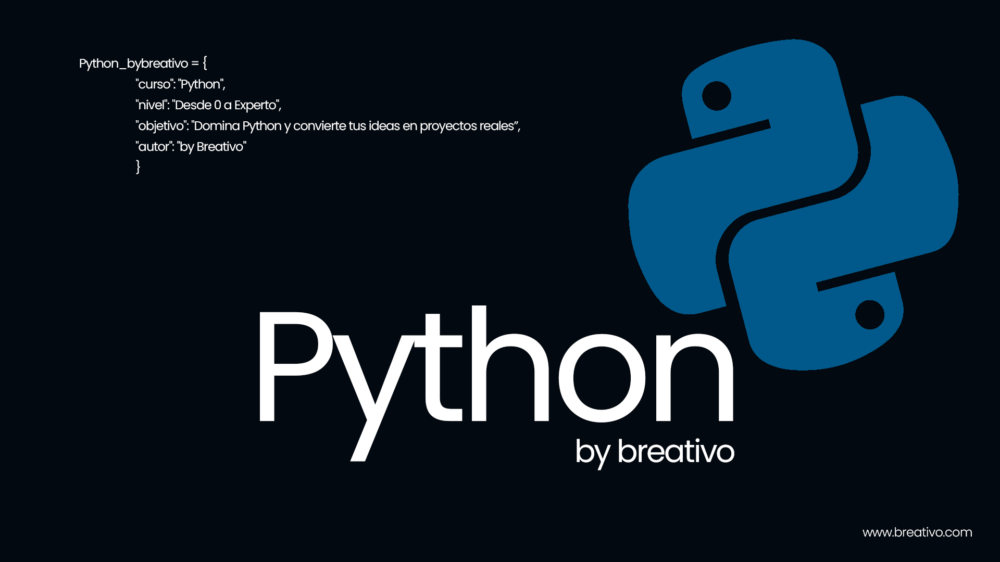

# Python by breativo

## Curso completo para aprender a trabajar con Python desde cero y para principiantes.

Python by breativo es un curso gratuito y completo, diseñado para que cualquier persona, sin importar su experiencia previa, pueda aprender Python de manera efectiva y práctica.

En este curso, comenzaremos desde los conceptos más básicos, explorando la sintaxis de Python, estructuras de datos, y flujos de control. A medida que avancemos, abordaremos temas más avanzados como programación orientada a objetos, manejo de excepciones, y acceso a bases de datos. Cada módulo incluirá ejercicios prácticos que te permitirán aplicar lo aprendido y desarrollar tus habilidades en situaciones del mundo real.

A lo largo del curso, tendrás la oportunidad de trabajar en proyectos prácticos que fortalecerán tu comprensión y te prepararán para desafíos en el ámbito laboral. Al finalizar, estarás listo para crear tus propias aplicaciones en Python, resolver problemas de programación de manera eficiente y utilizar bibliotecas populares que potencian las capacidades de Python en diversas áreas.
 

## Lo que aprenderás

#### Listado de lecciones
| Número | Lección           | Código | Video  |
|--------|-------------------|-------------|--------|
| 00    | Introducción a Python    |[Código]()|    |
| 01    | Variables en Python | [Codigo]()   |   |
 

#### Listado de ejercicios
| Número | Ejercicio           | Código | Video  |
|--------|-------------------|-------------|--------|
## Enlaces de interes

 

##  Hola, Soy Mario Bello (breativo)

Hola👋 mi nombre es Mario Bello con más de 5 años de experiencia en el desarrollo y diseño de soluciones digitales, me especializo en:

- Desarrollo Full Stack: Creación de aplicaciones web completas, desde frontend hasta backend, con integración y gestión de bases de datos.

- Desarrollo de Aplicaciones Móviles: Experiencia en iOS y Android utilizando lenguajes como Java, Kotlin y Python.

- Diseño y Branding de Marcas Personales: Desarrollo integral de identidades visuales, desde la conceptualización hasta la implementación.

- Diseño y Desarrollo Interactivo: Creación de experiencias digitales dinámicas y atractivas.

Mi enfoque combina habilidades técnicas con un fuerte sentido del diseño, aportando soluciones innovadoras y personalizadas.

 

### Otras bombitas by breativo

## ¡Apóyame! 
#### Puedes apoyar mi trabajo haciendo "☆ Star" en el repositorio. ¡Gracias!

### En mi perfil de GitHub tienes más información

